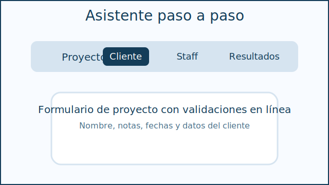
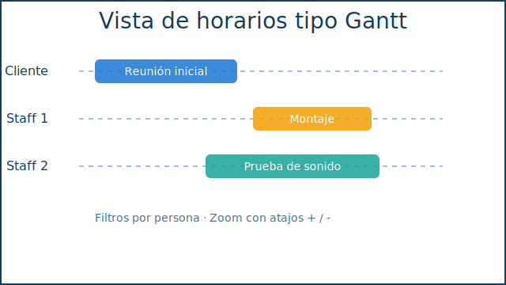
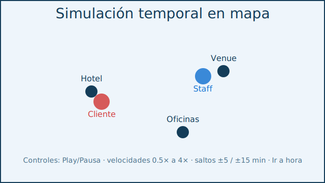
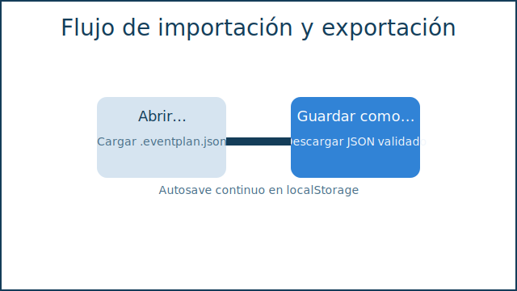

# Editor de Proyectos local

Aplicación React + TypeScript para planificar eventos sin backend. Todo se ejecuta en el navegador: se puede crear un proyecto, definir horarios para cliente y staff, gestionar materiales, visualizar resultados en Gantt, obtener agregados y simular el desplazamiento en un mapa estilizado. El estado se guarda automáticamente en `localStorage` y se puede importar/exportar mediante archivos `*.eventplan.json`.

## Requisitos

- Node.js 18 o superior
- npm 9 o superior

## Scripts principales

Todos los comandos se ejecutan dentro de `apps/project-editor/`:

```bash
npm install       # instala dependencias
npm run dev       # modo desarrollo (Vite)
npm run build     # genera build de producción
npm run start     # sirve la build generada (vite preview)
npm run validate  # typecheck + tests (unitarios + UI feliz)
```

## Flujo básico

1. Inicia la app (`npm run dev`) y abre el asistente.
2. Crea un proyecto nuevo, define nombre, fechas y datos de cliente.
3. Desde el paso **Cliente**, fija hora inicial y usa los botones `+5/+15/+30/+60` para generar segmentos consecutivos. Puedes crear ubicaciones, tareas y materiales al vuelo.
4. En **Staff** añade miembros y configura su propio horario (indicador de completo/incompleto).
5. En **Resultados**:
   - **Horarios**: vista Gantt filtrable y con zoom (`+`/`-`).
   - **Materiales**: tabla agregada con exportación CSV.
   - **Mapa**: simulación temporal con Play/Pausa (`Espacio`), velocidades 0.5×-4×, saltos ±5/±15 y "Ir a hora".
6. Usa el menú superior para **Nuevo**, **Abrir…** (`*.eventplan.json`) y **Guardar como…** (descarga del JSON validado). Atajos: `Ctrl+N`, `Ctrl+O`, `Ctrl+S`.

## Formato `*.eventplan.json`

El esquema está validado con [Zod](https://zod.dev) (`src/domain/types.ts`). Ejemplo recortado:

```json
{
  "id": "proj-123",
  "schemaVersion": 1,
  "nombre": "Evento Demo",
  "notas": "Checklist en Drive",
  "fechas": {
    "inicio": "2024-07-12T00:00:00.000Z",
    "fin": "2024-07-15T23:59:00.000Z"
  },
  "ubicaciones": [
    { "id": "loc-1", "nombre": "Hotel Centro", "lat": 40.4168, "lng": -3.7038 }
  ],
  "cliente": { "id": "cli-1", "nombre": "Ana Pérez", "rol": "CLIENTE" },
  "staff": [
    { "id": "team-1", "nombre": "Luis", "rol": "STAFF", "email": "luis@example.com" }
  ],
  "materiales": [
    { "id": "mat-1", "nombre": "Sillas plegables", "unidad": "unidad" }
  ],
  "tareas": [
    {
      "id": "task-1",
      "nombre": "Montaje",
      "requiereSubtareas": true,
      "defaultMaterials": [
        { "materialId": "mat-1", "cantidad": 10 }
      ]
    }
  ],
  "sesiones": [
    {
      "id": "sess-1",
      "ownerId": "cli-1",
      "ownerRol": "CLIENTE",
      "inicioISO": "2024-07-12T08:00:00.000Z",
      "finISO": "2024-07-12T08:30:00.000Z",
      "locationId": "loc-1",
      "tareaId": "task-1",
      "materiales": [ { "materialId": "mat-1", "cantidad": 4 } ]
    }
  ],
  "creadoAt": "2024-06-01T10:00:00.000Z",
  "actualizadoAt": "2024-06-01T10:00:00.000Z"
}
```

La importación valida el archivo completo; cualquier inconsistencia (IDs faltantes, tipos erróneos, versión distinta) lanza un mensaje en pantalla y se aborta la carga.

## Adaptadores reemplazables

Para facilitar cambios tecnológicos futuros, las integraciones externas están encapsuladas en `src/adapters/`:

| Adaptador | Propósito | Cómo sustituir |
|-----------|-----------|----------------|
| `adapters/state/store.ts` | Crea el store (Zustand). | Cambia la implementación por otra librería conservando la misma API (`createStore`). |
| `adapters/datetime/index.ts` | Utilidades basadas en `date-fns`. | Exporta las funciones con la firma actual usando otra librería o APIs nativas. |
| `adapters/uuid/index.ts` | Generador de IDs (`crypto.randomUUID`). | Sustituye por `nanoid`, `uuid`, etc. |
| `adapters/file/download.ts` / `upload.ts` | Descarga y selección de archivos. | Reemplaza por APIs nativas/terceros manteniendo la promesa/función. |
| `adapters/storage/local.ts` | Lectura/escritura de autosave. | Cambia el mecanismo de persistencia (IndexedDB, file system) sin tocar el resto del código. |

## Tests

- **Core**: validan detección de solapes, agregación de materiales y serialización exacta.
- **UI**: un test feliz recorre el asistente completo y comprueba que el JSON se exporta.

Ejecuta todo con `npm run validate`.

## Capturas / diagramas

Las vistas principales se documentan en `/docs`:

- 
- 
- 
- 

## Limitaciones conocidas

- El mapa usa una proyección simple (normaliza lat/lng o genera una cuadrícula cartesiana si faltan coordenadas).
- Las confirmaciones de creación rápida utilizan `window.prompt`. Para experiencias más ricas puede integrarse un sistema de formularios modal.
- No hay control de versiones sobre el autosave (solo se guarda el último estado). Se puede ampliar el adapter de `storage` para mantener historial.
